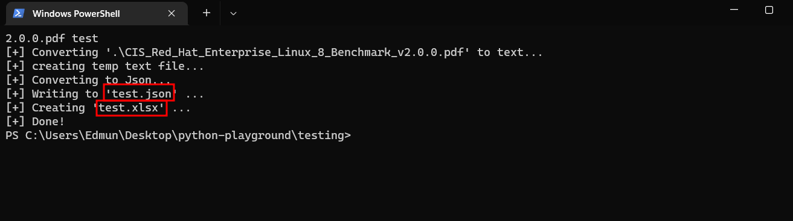
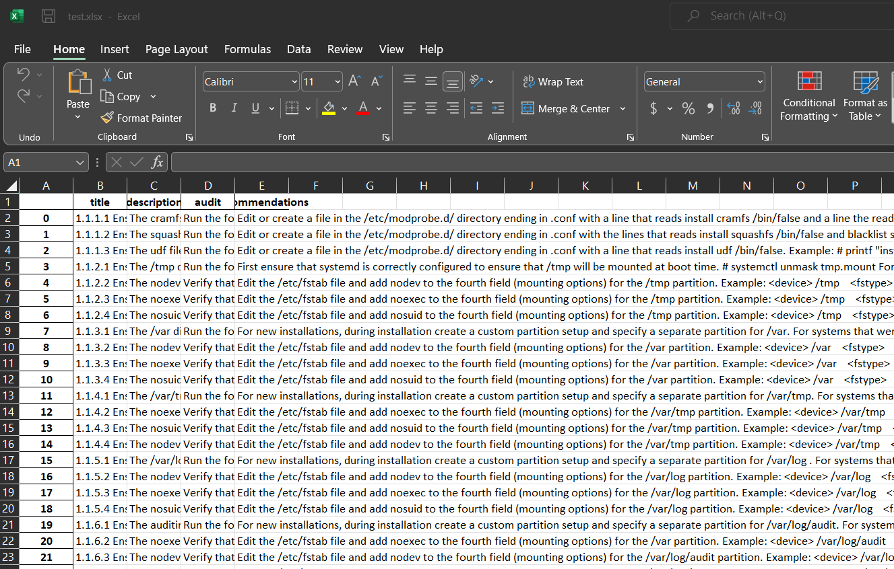
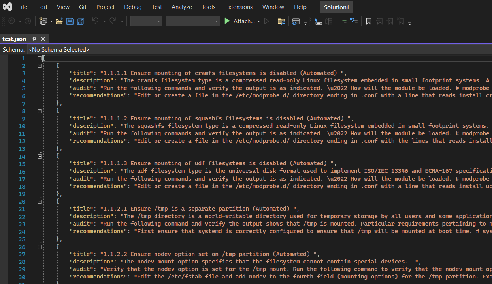

# CIS PDF to Excel
Convert CIS PDF benchmarks to Excel and Json formats. Useful for reviewing newer benchmarks when .audit files are not released by Nessus yet.


## Description

Reads CIS pdf benchmark and captures the following info
1. CIS item title
2. Description
3. Audit (commands used to check compliance)
4. Recommendations (comply values)

Exports it into json formats for other use if desired and finally converts into excel file


## Installation

- install java
- pip install tika
- pip install pandas
- pip install openpyxl
- get the 'cis_to_excel.py' file

## Usage

Place CIS benchmark in same running directory, eg. `CIS_Red_Hat_Enterprise_Linux_8_Benchmark_v2.0.0.pdf` 

```bash
python cis_to_excel.py CIS_Red_Hat_Enterprise_Linux_8_Benchmark_v2.0.0.pdf output
```
- 'input' will be CIS benchmark pdf in same directory
- 'output' will be used to generate 'output.xlsx' and 'output.json'. It is not necessary to provide the extension

The following files will be created
- output.json
- output.xlsx

### Screens





